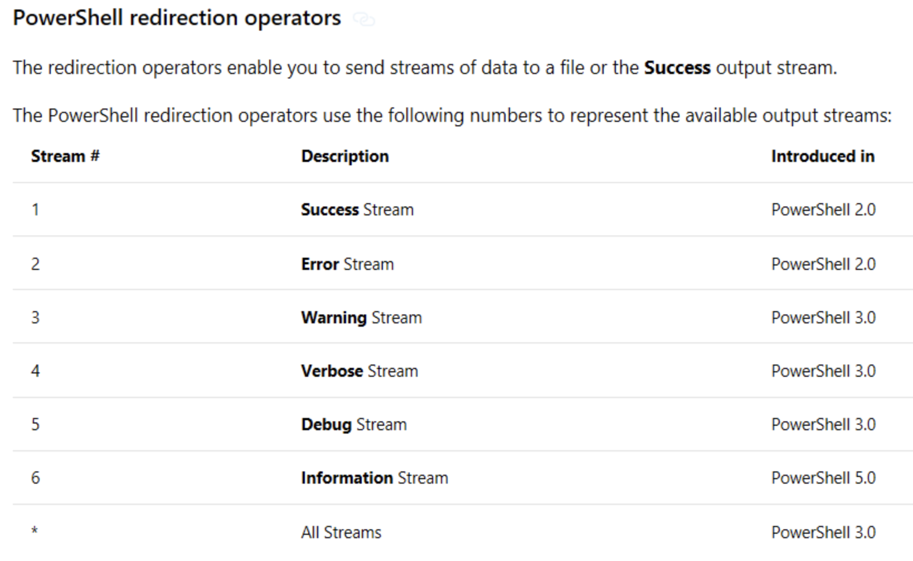

# PowerCli_logging_Example

#### SAMPLE Script

```
$out = try
{
  get-vm -Name penvpn -ErrorAction Stop
  #get-vm -Name penvpn
  get-vm -Name openvpn
}
catch
{ $_.Exception.Message }

echo $out
```

#### Error Logging Example




```
./test2.ps1 5>&1 4>&1 3>&1 2>&1 | Out-file log.txt

```

```
PS /home/netops> cat ./log
03/19/2023 11:13:01	Get-VM		VM with name 'penvpn' was not found using the specified filter(s).
```
